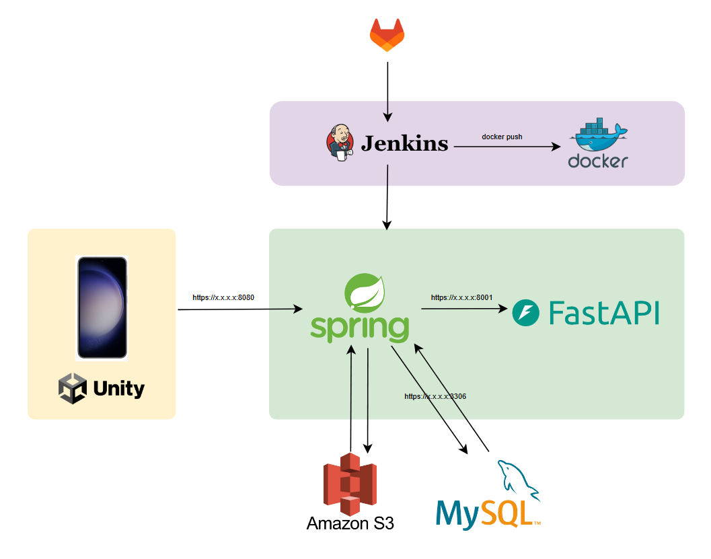
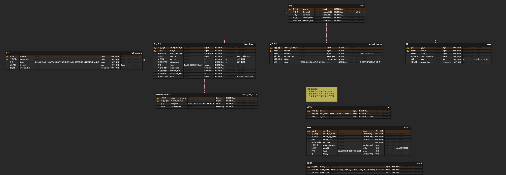

# 

##  프로젝트 소개

아이를 위한 곤충 육성 애플리케이션

### 1. 프로젝트 목표

- 아이들이 곤충을 관찰하고 돌보며 곤충 생태계를 학습할 수 있는 교육용 애플리케이션

 

### 2. 프로젝트를 하게 된 배경 또는 근거

**정서곤충**이란 사람들이 곁에 두고 기르며 자연을 이해하고 심리적 안정을 찾을 수 있게 도와주는 곤충을 의미한다. 이러한 곤충을 돌보는 것은 정서지능을 발달시키는 데 도움을 주며, 특히 우울, 스트레스, 불안을 줄여주는 효과가 있다고 알려져 있다.

- **정서적 안정과 정서지능 발달**: 곤충을 기르고 관찰하는 과정은 후천적으로 학습 가능한 정서지능을 발달시키는 데 도움이 된다. 이는 아이들이 감정을 더 잘 조절하고 타인과의 관계를 원만하게 유지하는 능력을 기르도록 한다.
- **곤충을 통한 심리적 안정**: 곤충을 돌보는 활동은 심리적인 안정감을 제공하며, 이는 스트레스와 불안을 줄여주는 긍정적인 효과로 이어질 수 있다.
- **자연과의 상호작용**: 직접 자연에서 곤충을 기르는 것보다 AR로 구현된 가상 환경에서 더 안전하고 접근성 높은 경험을 제공함으로써, 언제 어디서나 곤충 생태계를 쉽게 경험할 수 있다.

 

### 3. 주요 기능

- **사진으로 곤충 채집 및 AI 분류**
  - 사용자가 곤충을 찍으면 AI가 자동으로 곤충을 인식하고 분류해 도감에 저장
  - 곤충을 채집하고 관찰하는 과정을 통해 생태계에 대한 흥미를 유발
- **곤충 키우기 (AR 상호작용)**
  - AR 기능을 통해 곤충이 움직이고 먹이를 먹는 모습을 생생하게 관찰 가능

 

### 4. 프로젝트를 통한 기대효과

- **곤충 체험의 교육적 가치**
- **인지 기능 향상**
- **자연과의 정서적 연결**

 
 

## 🖥 기술스택

### 1. 아키텍처

 

### 2. 기술스택

 

 
 

## 📱시연 움짤

 
 

## 🔧 ERD

 
 

## 😶 팀원소개

|  |                                        |        |                                                  |               |             |
| :-------------------------------------------------------: | :---------------------------------------------------------------------------------------------: | :-------------------------------------------------------------: | :-------------------------------------------------------------------------------------------------------: | :--------------------------------------------------------------------: | :------------------------------------------------------------------: |
|                          강민서                           |                                             김민채                                              |                             서지흔                              |                                                   서희                                                    |                                 정호성                                 |                                조원우                                |
|                           Infra                           |                                        Backend, Frontend                                        |                               AR                                |                                             Backend, Frontend                                             |                              AI, Frontend                              |                           Design, Frontend                           |
|                  기획,   Infra, CI/CD                  | 기획, DB설계,   도감 관련 API 구현,   푸시알림 구현,   화면 구현   (채집, 회원가입) | 기획,   AR 기능 구현,   화면 구현 및 API 연동   (육성) | 기획, DB설계,   채집 및 육성 관련 API 구현,   화면 구현 및 API 연동   (채집결과, 곤충상세, 도감) | 기획,   곤충 판별 AI 구현,   화면 API 연동   (채집, 회원가입) | 기획,   화면 디자인,   화면 구현 및 API 연동   (메인페이지) |
